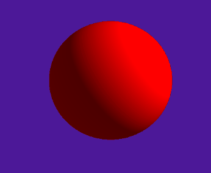

# SDF
# 感谢
感谢https://www.iquilezles.org/www/articles/distfunctions/distfunctions.htm
这个是大佬，网上能找到的SDF基本上都是基于这个大佬的这个网站
感谢https://github.com/JiepengTan/Unity-Raymarching-Framework
他的framework很好用
# 条件
Unity2018及以上。选择process场景
# SDF
第一次看到，被这个算法惊艳。这么的简单，可以做出非常复杂的东西。
限制它的结果的只有GPU的速度跟你的想象力。

